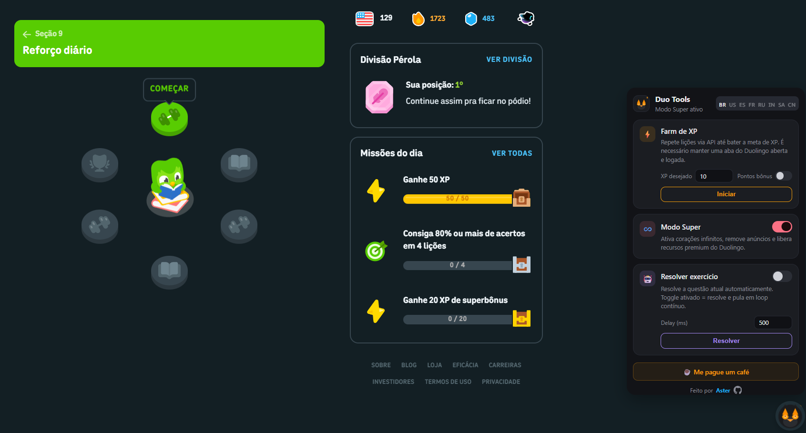
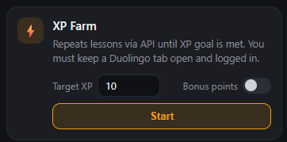
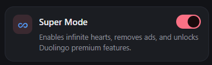
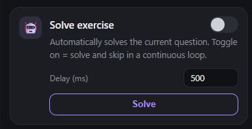
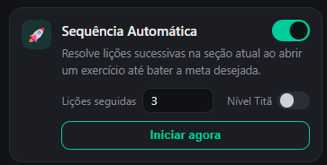
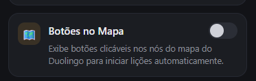

# Duo Tools — Extensão Chrome Manifest V3

Farm de XP · Modo Super · Resolver exercícios · Sequência Automática · Botões no Mapa



## Como instalar

1. Acesse a página de Releases do projeto e baixe o arquivo oficial `Duo-Tools.zip` da última versão.
2. Extraia (descompacte) o arquivo `.zip` baixado em uma pasta de fácil acesso no seu computador.
3. Abra o Chrome e navegue para `chrome://extensions`
4. Ative o **Modo desenvolvedor** (toggle no canto superior direito)
5. Clique em **"Carregar sem compactação"**
6. Selecione a pasta `Duo-Tools` que você acabou de extrair (⚠️ Atenção: selecione a pasta descompactada, e não o arquivo .zip).
7. Pronto! A extensão aparecerá com o ícone de uma coruja escura com detalhes em âmbar/laranja na sua barra de ferramentas.

## Funcionalidades

### ⚡ Farm de XP



- Define quantos XP quer ganhar e clica em **Iniciar**
- Barra de progresso em tempo real
- Checkbox "Pontos bônus" habilita enableBonusPoints na API
- Funciona via chamadas diretas à API do Duolingo (não precisa interagir com a UI)

### ♾️ Modo Super



- Toggle simples On/Off
- Intercepta e patcha os chunks JS do Duolingo para ativar `hasPlus: true` e `gold_subscription`
- Remove limitações de corações e anúncios

### 🤖 Resolver exercício



- **Botão "Resolver"**: resolve a questão atual sem avançar
- **Toggle "Resolver e pular"**: quando ativado, o botão resolve e pula em loop contínuo
- **Campo "Delay (ms)"**: controla o intervalo entre ações
- Hotkeys: `Ctrl+Enter` = resolver+pular, `Alt+Enter` = só resolver, `Alt+S` = pular fala

### 🚀 Sequência Automática



- Resolve lições sucessivas na seção atual ao abrir um exercício até bater a meta desejada
- **Campo "Lições seguidas"**: define a quantidade de lições completadas de forma consecutiva
- **Toggle "Nível Titã"**: ativa a resolução do desafio no nível Legendário/Titã
- **Botão "Iniciar agora"**: inicia imediatamente o processo automatizado na lição aberta

### 🗺️ Botões no Mapa



- Toggle On/Off de fácil ativação
- Exibe botões clicáveis nos nós do mapa do Duolingo para iniciar lições automaticamente
- Permite avançar e concluir os exercícios diretamente pelos ícones no mapa principal

### 🪟 Widget Flutuante In-Page


- Interface integrada diretamente na página do Duolingo (canto inferior direito)
- Acesso rápido a todas as funções sem precisar abrir o popup da extensão
- Pode ser ocultado/exibido através das configurações
- Suporte completo a múltiplos idiomas (Internacionalização)

## Estrutura do projeto

```
Duo-Tools/
├── manifest.json              # MV3, permissions combinadas dos 3 originais
├── content-script.js          # Mundo isolado: proxy API + bridge postMessage
├── page-patch.js              # Mundo MAIN: intercepta chunks JS do Duolingo
│
├── background/
│   └── background.js          # Service worker: farm XP + relay de patches
│
├── popup/
│   ├── popup.html             # UI com os 3 cards + botão café
│   ├── popup.css              # Design 100% do duo-tools-extension
│   └── popup.js               # Lógica dos controles do popup
│
├── widget/
│   ├── widget.html            # UI do widget flutuante injetado na página
│   ├── widget.css             # Estilos do widget flutuante
│   └── widget.js              # Lógica do widget flutuante
│
├── i18n/
│   └── i18n.js                # Sistema de internacionalização (i18n)
│
├── content_scripts/
│   ├── injected.js            # Roda no mundo da página (React internals)
│   ├── DuolingoChallenge.js   # Resolver todos os tipos de desafio
│   ├── DuolingoSkill.js       # State machine para completar lições inteiras
│   ├── ReactUtils.js          # Utilitários para acessar React fiber
│   └── main.css               # CSS dos botões de skill na página do Duolingo
│
├── icons/                     # icon16/32/48/128.png
└── images/                    # Ícones e assets visuais da extensão
```
